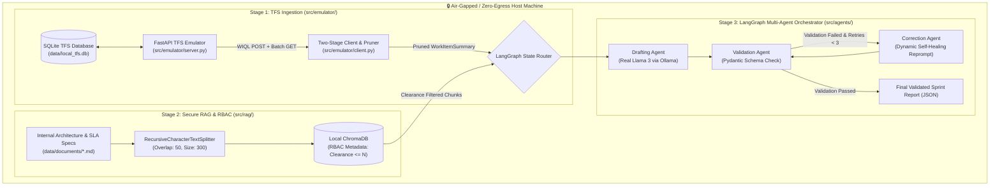

# 🛡️ TFS Agent: Zero-Egress Multi-Agent DevOps Pipeline

[](https://www.python.org/downloads/)
[](https://fastapi.tiangolo.com)
[](https://langchain-ai.github.io/langgraph/)
[](https://www.trychroma.com/)
[](https://ollama.ai/)
[](https://docs.pydantic.dev/)
[](LICENSE)

An enterprise-grade, **air-gapped, zero-egress AI agent pipeline** designed to ingest, prune, validate, and synthesize work items from **Azure DevOps (TFS)**. By combining **100% real local LLM execution (Llama 3 via Ollama)**, **ChromaDB RAG with Role-Based Access Control (RBAC)**, and **LangGraph self-healing stateful workflows**, this system completely eliminates corporate data leakage and compliance violations.

> 🤖 **AI Assistant Handover:** If you are an AI model taking over this repository, refer to **[`docs/gpt_follow_up.md`](docs/gpt_follow_up.md)** for a complete, self-contained architecture and implementation handover guide.

---

## 📑 Table of Contents
- [Architecture & Philosophy](#-architecture--philosophy)
- [Key Features](#-key-features)
- [System Architecture Diagram](#-system-architecture-diagram)
- [Professional Repository Structure](#-professional-repository-structure)
- [Prerequisites](#-prerequisites)
- [Quickstart Guide](#-quickstart-guide)
  - [1. Environment Setup](#1-environment-setup)
  - [2. Unified CLI Usage (`main.py`)](#2-unified-cli-usage-mainpy)
  - [3. Standalone Demonstrations (`demonstrations/`)](#3-standalone-demonstrations-demonstrations)
- [Data Contract & Payload Engineering](#-data-contract--payload-engineering)
- [Project Roadmap & Status](#-project-roadmap--status)
- [License](#-license)

---

## 🔒 Architecture & Philosophy

In regulated enterprise environments (e.g., healthcare, finance, defense), uploading proprietary source code, internal system architectures, and Personal Health Information (PHI) to cloud LLMs (OpenAI, Azure OpenAI, Anthropic) violates data protection mandates.

**TFS Agent** enforces a strict **Zero-Egress** model:
* **100% Real Local Inference**: Prompts and context are processed on-premises using **real local Llama 3 via Ollama** (`ChatOllama`).
* **Two-Stage Ingestion**: Eliminates context window bloat by converting raw Azure DevOps JSON into lightweight, strongly-typed Pydantic summaries.
* **Retrieval-Layer RBAC**: ChromaDB vector queries enforce security clearance constraints (`clearance <= user_level`) at the mathematical index layer before context reaches the agent.
* **Self-Healing State Graph**: LangGraph multi-agent loop automatically catches malformed JSON or incomplete fields and reprompts Llama 3 for self-correction.

---

## ✨ Key Features

| Stage | Package | Technology | Capability | Status |
| :--- | :--- | :--- | :--- | :---: |
| **1. Ingestion & Pruning** | `src/emulator/` | FastAPI + SQLite + Pydantic v2 | Simulates Azure DevOps WIQL endpoints; strips system metadata, GUIDs, and raw HTML formatting. | ✅ Complete |
| **2. Secure RAG & RBAC** | `src/rag/` | ChromaDB + LangChain Splitters | Semantic chunking with mathematical `$lte` metadata security clearance filtering (Level 1–3). | ✅ Complete |
| **3. Multi-Agent Orchestrator** | `src/agents/` | LangGraph + Real Llama 3 (Ollama) | Stateful multi-agent graph: TFS Retrieval Node $\rightarrow$ RAG Retrieval Node $\rightarrow$ Drafting Node $\rightarrow$ Pydantic Validation Node $\rightarrow$ Self-Healing Loop. | ✅ Complete |
| **4. Network Resilience** | `src/resilience/` | Tenacity + Exponential Backoff | Gateway layer with retry jitter to gracefully handle transient network drops, 429s, and 500 errors. | ✅ Complete |

---

## 📐 System Architecture Diagram



---

## 📂 Professional Repository Structure

```text
tfs_agent/
├── main.py                            # Unified CLI & pipeline entrypoint
├── requirements.txt                   # Python dependency manifest
├── verify_env.py                      # Environment verification & dependency checker
├── README.md                          # Repository documentation & architecture guide
│
├── src/                               # 📦 Core Modular Source Code
│   ├── emulator/                      # Stage 1: TFS API Emulator, Seeder & Client
│   │   ├── server.py                  # FastAPI REST API server (port 8000)
│   │   ├── seeder.py                  # Database initialization script
│   │   └── client.py                  # Two-stage client with HTML stripping & Pydantic pruning
│   │
│   ├── rag/                           # Stage 2: ChromaDB Vector Store & RBAC
│   │   ├── indexer.py                 # Semantic chunking & vector indexing
│   │   └── search.py                  # Retrieval-layer RBAC similarity search
│   │
│   ├── agents/                        # Stage 3: LangGraph Multi-Agent Orchestrator
│   │   ├── schemas.py                 # Pydantic state & report contracts
│   │   ├── tools.py                   # LangChain tool connectors
│   │   └── orchestrator.py            # LangGraph multi-agent state graph (Real Llama 3)
│   │
│   └── resilience/                    # Stage 4: Network Resilience Gateway
│       └── gateway.py                 # Tenacity retry & exponential backoff
│
├── data/                              # 💾 Data, Models & Storage
│   ├── tfs_dataset.json               # Seed enterprise dataset (12 work items)
│   ├── mock_tfs_response.json         # Offline mock payload
│   ├── local_tfs.db                   # SQLite database
│   ├── local_chroma_db/               # Persistent ChromaDB vector store
│   └── documents/                     # Internal corporate docs (Level 1, 2, 3)
│       ├── engineering_handbook.md    # Level 1 (General)
│       ├── adjudication_architecture.md # Level 2 (Internal Engineering SLAs)
│       └── security_policy.md         # Level 3 (Zero-Egress & Confidential)
│
├── demonstrations/                    # 🧪 Standalone Capability Scripts (1 to 7)
│   ├── 01_tfs_two_stage_ingestion_demo.py
│   ├── 02_semantic_chunking_and_chroma_demo.py
│   ├── 03_rbac_vector_search_demo.py
│   ├── 04_local_llama3_ollama_demo.py
│   ├── 05_pydantic_structured_output_demo.py
│   ├── 06_langgraph_multiagent_self_healing_demo.py
│   ├── 07_network_resilience_tenacity_demo.py
│   └── MAJOR_FUNCTIONS.md             # Complete function & API inventory
│
└── docs/                              # 📖 Documentation & Architecture Guides
    ├── gpt_follow_up.md               # AI Handover & Context Guide
    ├── PROJECT_STATUS.md              # Milestone & audit tracker
    ├── project_implementation_writeup.md # Original architectural writeup
    ├── real_llm_guide.py              # Tutorial on real LLMs & structured output
    └── what_have_I_learnt.md          # Project learning notes
```

---

## 🛠️ Prerequisites

* **OS**: macOS / Linux / Windows WSL2
* **Python**: `3.10` or higher (Conda recommended: `ai_agent`)
* **Ollama**: Local LLM runner ([Download Ollama](https://ollama.ai))
  ```bash
  ollama pull llama3
  ```

---

## 🚀 Quickstart Guide

### 1. Environment Setup

```bash
# Using Conda
conda create -n ai_agent python=3.12 -y
conda activate ai_agent

# Install dependencies
pip install -r requirements.txt
python verify_env.py
```

---

### 2. Unified CLI Usage (`main.py`)

The root `main.py` provides a unified interface for all operations:

```bash
# 1. Run complete pipeline end-to-end (Seeding -> RAG Indexing -> Multi-Agent Execution)
python main.py --run-all

# 2. Seed the enterprise database
python main.py --seed

# 3. Start local TFS emulator server
python main.py --start-server

# 4. Build ChromaDB vector store
python main.py --build-rag

# 5. Test TFS API client
python main.py --test-client

# 6. Test ChromaDB RBAC search
python main.py --test-rag --clearance 2

# 7. Run LangGraph Multi-Agent Orchestrator
python main.py --run-agent --clearance 2
```

---

### 3. Standalone Demonstrations (`demonstrations/`)

To test and learn each component in isolation, run any of the standalone demo scripts:

```bash
python demonstrations/01_tfs_two_stage_ingestion_demo.py
python demonstrations/02_semantic_chunking_and_chroma_demo.py
python demonstrations/03_rbac_vector_search_demo.py
python demonstrations/04_local_llama3_ollama_demo.py
python demonstrations/05_pydantic_structured_output_demo.py
python demonstrations/06_langgraph_multiagent_self_healing_demo.py
python demonstrations/07_network_resilience_tenacity_demo.py
```

See **[`demonstrations/MAJOR_FUNCTIONS.md`](demonstrations/MAJOR_FUNCTIONS.md)** for a full function-by-function reference.

---

## 📊 Data Contract & Payload Engineering

`WorkItemSummary` enforces a strict Pydantic v2 contract:

```python
from pydantic import BaseModel, Field
from typing import List, Optional

class WorkItemSummary(BaseModel):
    id: int
    title: str
    work_item_type: str = Field(alias="type")
    state: str
    assigned_to: str
    priority: int = 2
    severity: Optional[str] = None
    iteration_path: Optional[str] = None
    tags: List[str] = Field(default_factory=list)
    description: str

    model_config = {"populate_by_name": True}
```

---

## 📜 License

Distributed under the **MIT License**. See `LICENSE` for more information.
