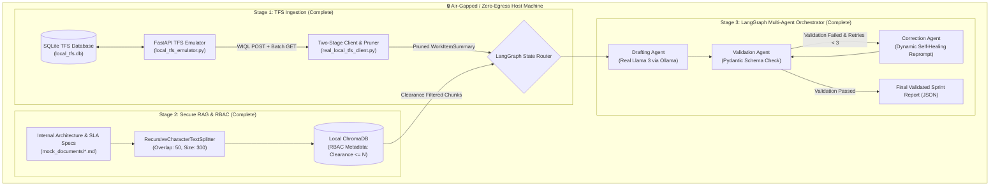

# 🛡️ TFS Agent: Zero-Egress Multi-Agent DevOps Pipeline

[](https://www.python.org/downloads/)
[](https://fastapi.tiangolo.com)
[](https://langchain-ai.github.io/langgraph/)
[](https://www.trychroma.com/)
[](https://ollama.ai/)
[](https://docs.pydantic.dev/)
[](LICENSE)

An enterprise-grade, **air-gapped, zero-egress AI agent pipeline** designed to ingest, prune, validate, and synthesize work items from **Azure DevOps (TFS)**. By combining **100% real local LLM execution (Llama 3 via Ollama)**, **ChromaDB RAG with Role-Based Access Control (RBAC)**, and **LangGraph self-healing stateful workflows**, this system completely eliminates corporate data leakage and compliance violations.

> 🤖 **AI Assistant Handover:** If you are an AI model taking over this repository, refer to **[`gpt_follow_up.md`](gpt_follow_up.md)** for a complete, self-contained architecture and implementation handover guide.

---

## 📑 Table of Contents
- [Architecture & Philosophy](#-architecture--philosophy)
- [Key Features](#-key-features)
- [System Architecture Diagram](#-system-architecture-diagram)
- [Repository Structure](#-repository-structure)
- [Prerequisites](#-prerequisites)
- [Quickstart Guide](#-quickstart-guide)
  - [1. Environment Setup](#1-environment-setup)
  - [2. Seed Enterprise Database](#2-seed-enterprise-database)
  - [3. Start Local TFS Emulator](#3-start-local-tfs-emulator)
  - [4. Test Two-Stage Data Ingestion](#4-test-two-stage-data-ingestion)
  - [5. Build & Query Vector Store with RBAC](#5-build--query-vector-store-with-rbac)
  - [6. Execute Multi-Agent Orchestrator](#6-execute-multi-agent-orchestrator)
- [Data Contract & Payload Engineering](#-data-contract--payload-engineering)
- [Project Roadmap & Status](#-project-roadmap--status)
- [License](#-license)

---

## 🔒 Architecture & Philosophy

In regulated enterprise environments (e.g., healthcare, finance, defense), uploading proprietary source code, internal system architectures, and Personal Health Information (PHI) to cloud LLMs (OpenAI, Azure OpenAI, Anthropic) violates data protection mandates.

**TFS Agent** enforces a strict **Zero-Egress** model:
* **100% Real Local Inference**: Prompts and context are processed on-premises using **real local Llama 3 via Ollama** (`ChatOllama`).
* **Two-Stage Ingestion**: Eliminates context window bloat by converting raw Azure DevOps JSON into lightweight, strongly-typed Pydantic summaries.
* **Retrieval-Layer RBAC**: ChromaDB vector queries enforce security clearance constraints (`clearance <= user_level`) at the mathematical index layer before context reaches the agent.
* **Self-Healing State Graph**: LangGraph multi-agent loop automatically catches malformed JSON or incomplete fields and reprompts Llama 3 for self-correction.

---

## ✨ Key Features

| Stage | Technology | Capability | Status |
| :--- | :--- | :--- | :---: |
| **1. Payload Engineering** | FastAPI + SQLite + Pydantic v2 | Simulates Azure DevOps WIQL endpoints; strips system metadata, GUIDs, and raw HTML formatting. | ✅ Complete |
| **2. Secure RAG & RBAC** | ChromaDB + LangChain Splitters | Semantic chunking with mathematical `$lte` metadata security clearance filtering (Level 1–3). | ✅ Complete |
| **3. Multi-Agent Orchestrator** | LangGraph + Real Llama 3 (Ollama) | Stateful multi-agent graph: TFS Retrieval Node $\rightarrow$ RAG Retrieval Node $\rightarrow$ Drafting Node $\rightarrow$ Pydantic Validation Node $\rightarrow$ Self-Healing Loop. | ✅ Complete |
| **4. Network Resilience** | Tenacity + Exponential Backoff | Gateway layer with retry jitter to gracefully handle transient network drops, 429s, and 500 errors. | 🟡 Up Next |

---

## 📐 System Architecture Diagram



---

## 📂 Repository Structure

```text
tfs_agent/
├── README.md                          # Repository documentation & architecture guide
├── gpt_follow_up.md                   # Complete AI handover & project context guide
├── PROJECT_STATUS.md                  # Detailed implementation status & audit tracker
├── project_implementation_writeup.md  # Original architectural specification
│
├── local_tfs_emulator.py              # FastAPI server simulating Azure DevOps / TFS REST API
├── seed_database.py                   # Populates SQLite with enterprise work items
├── tfs_dataset.json                   # 12+ realistic work items (Bugs, Tasks, Stories, Epics)
├── local_tfs.db                       # Local SQLite database backing the TFS emulator
│
├── real_local_tfs_client.py           # Two-stage HTTP client with HTML stripping & Pydantic pruning
├── mock_tfs_client.py                 # Offline mock TFS client
├── mock_tfs_response.json             # Raw Azure DevOps response payload for offline tests
│
├── mock_documents/                    # Enterprise internal documentation
│   ├── engineering_handbook.md        # Clearance Level 1 (General)
│   ├── adjudication_architecture.md   # Clearance Level 2 (Internal Engineering SLAs)
│   └── security_policy.md             # Clearance Level 3 (Zero-Egress & Confidential)
│
├── build_vector_store.py              # Chunker & ChromaDB ingest script with RBAC tags
├── query_vector_store.py              # Vector similarity search with clearance filtering
│
├── agent_tools.py                     # LangChain @tool wrappers connected to live TFS & ChromaDB
├── test_agent_tools.py                # Unit test for agent tools
├── real_llm_guide.py                  # Hands-on tutorial on real LLMs, Pydantic schemas, and cloud switching
│
├── agent_orchestrator.py              # LangGraph state graph powered by real Llama 3
├── agent_orchestration_test.py        # Multi-agent test suite powered by real Llama 3
├── agent_orchestrator_real_llm.py     # Production LangGraph pipeline (TFS + RAG + Llama 3 + Self-Healing)
└── verify_env.py                      # Environment verification & dependency checker
```

---

## 🛠️ Prerequisites

* **OS**: macOS / Linux / Windows WSL2
* **Python**: `3.10` or higher (Conda recommended: `ai_agent`)
* **Ollama**: Local LLM runner ([Download Ollama](https://ollama.ai))
  ```bash
  ollama pull llama3
  ```

---

## 🚀 Quickstart Guide

### 1. Environment Setup

Create and activate a virtual environment or Conda environment:

```bash
# Using Conda
conda create -n ai_agent python=3.12 -y
conda activate ai_agent

# Install dependencies
pip install fastapi uvicorn requests requests-ntlm pydantic tenacity chromadb langchain langgraph langchain-ollama langchain-text-splitters
```

Verify your installation:
```bash
python verify_env.py
```

---

### 2. Seed Enterprise Database

Populate the local SQLite database with realistic work items and generate mock response files:

```bash
python seed_database.py
```

---

### 3. Start Local TFS Emulator

Launch the local FastAPI server simulating Azure DevOps REST API:

```bash
python local_tfs_emulator.py
```
* The server runs at: `http://127.0.0.1:8000`
* Interactive Swagger Docs available at: `http://127.0.0.1:8000/docs`

---

### 4. Test Two-Stage Data Ingestion

In a separate terminal, execute the client to query active bugs and verify Pydantic normalization:

```bash
python real_local_tfs_client.py
```

---

### 5. Build & Query Vector Store with RBAC

Ingest engineering specs and policies into ChromaDB with Role-Based Access Control tags, then run multi-clearance verification:

```bash
python build_vector_store.py
python query_vector_store.py
```

**RBAC Clearance Matrix:**
* **Level 1 (Junior Engineer):** Public general handbook only; confidential architecture specs are mathematically hidden.
* **Level 2 (Senior Engineer):** Unlocks exact NTLM SLA retry rules (3 attempts, 500ms jittered backoff, 30s timeout ceiling).
* **Level 3 (Compliance Officer):** Unlocks confidential SEC-099 Zero-Egress mandates and cloud API prohibitions.

---

### 6. Execute Multi-Agent Orchestrator (Powered by Real Llama 3)

Start the Ollama daemon and run the LangGraph self-healing pipeline:

```bash
# Terminal 1: Start Ollama service (if not already running)
ollama serve

# Terminal 2: Run LangGraph orchestrator
python agent_orchestrator_real_llm.py
```

**Live Self-Healing Execution Trace:**
```text
=================================================================
-> [Node 1: TFS Retrieval Agent] Ingested and pruned 9 active work items.
-> [Node 2: RAG Retrieval Agent] Injected 3 RBAC-verified architecture context chunks.
-> [Node 3: Drafting Agent] Prompting local Llama 3 to synthesize report...
-> [Node 4: Validation Agent] Enforcing Pydantic SprintReportSchema...
   ❌ FAILED: JSON Syntax Error: Expecting ',' delimiter...
   [Router] Routing state -> Correction Agent.
-> [Node 5: Correction Agent] SELF-HEALING LOOP (Attempt 1/3)
   Fixing Error with Llama 3...
-> [Node 4: Validation Agent] Enforcing Pydantic SprintReportSchema...
   ✅ Pydantic Contract PASSED with 0 errors.
   [Router] Validation succeeded. Routing -> END.
=================================================================
```

---

## 📊 Data Contract & Payload Engineering

`WorkItemSummary` enforces a strict Pydantic v2 contract:

```python
from pydantic import BaseModel, Field
from typing import List, Optional

class WorkItemSummary(BaseModel):
    id: int
    title: str
    work_item_type: str = Field(alias="type")
    state: str
    assigned_to: str
    priority: int = 2
    severity: Optional[str] = None
    iteration_path: Optional[str] = None
    tags: List[str] = Field(default_factory=list)
    description: str

    model_config = {"populate_by_name": True}
```

---

## 🗺️ Project Roadmap & Status

For a line-by-line audit and upcoming milestones, see **[PROJECT_STATUS.md](PROJECT_STATUS.md)** and **[gpt_follow_up.md](gpt_follow_up.md)**.

- [x] **Stage 1**: Local TFS API Emulator & Two-Stage Pydantic Ingestion
- [x] **Stage 1**: Enterprise SQLite Dataset Seeding & Mock JSON generation
- [x] **Stage 2**: Ingest complete corporate architecture docs & RBAC clearance tests (`mock_documents/`, ChromaDB)
- [x] **Stage 2**: Retrieval-layer `$lte` mathematical clearance filtering
- [x] **Stage 3**: Wire `agent_tools.py` directly to live TFS & ChromaDB backends
- [x] **Stage 3**: Integrate real local Llama 3 (Ollama) across all orchestrator scripts
- [x] **Stage 3**: Production LangGraph pipeline with dynamic self-healing correction loop
- [ ] **Stage 4**: Network Resilience Gateway with Tenacity retry & exponential backoff

---

## 📜 License

Distributed under the **MIT License**. See `LICENSE` for more information.
